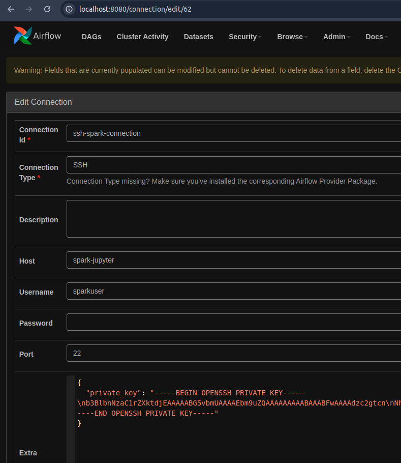
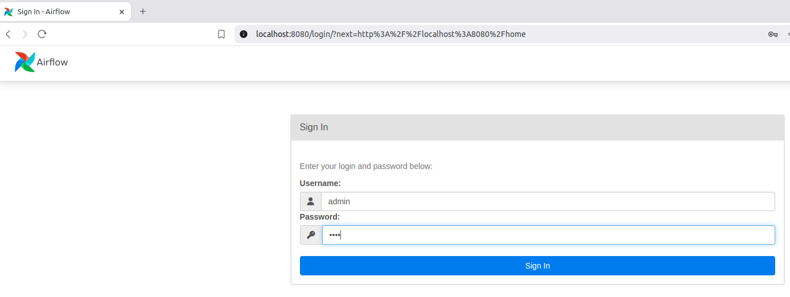
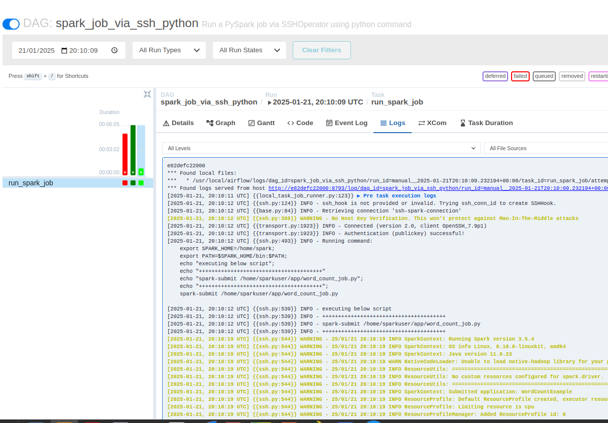
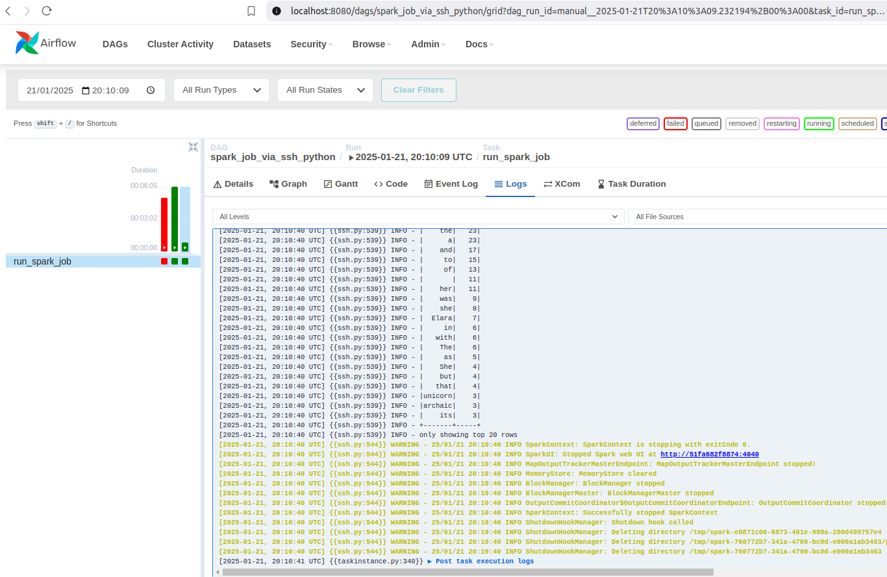

# Spark-DP-201

### Architecture
In this architecture the Airflow container is directly connecting to spark container via ssh connection 
and also via docker network bridge. However an Ideal architecture can have an intermediate node (Edge Node) 
that acts as bridge between Spark and Airflow. But as the quote goes *Simple is Beautiful*, so let's go ahead 
with this simple setup.  
> 


## How to use this setup to run airflow and Spark:

### Step 1: Clone the repository.   
   ```commandline
   git clone git@github.com:experientlabs/spark-dp-101.git
   ```

### Step 2. Generate ssh key pair.
This will be used for establishing communication between airflow and spark nodes. 
So that airflow can run ssh jobs on spark node

```shell
./de-local-env generate-ssh-key
```

### Step 3. Build Image.

```shell
./de-local-env build-image
```

### Step 4. Run the setup.

```shell
./de-local-env start
```

### Step 5. Run the `setup_connections.py` to create ssh connections in Airflow. 

```shell
pyton setup_connections.py
```



### Step 6. Allow container to write to app directory which is used as volume mount
```shell
chmod -R 777 app/
```

> Feel free to post in the comment section if you run across any problem. 

# Apache Spark and Airflow UI is accessible here:
1. Jupyter Notebook http://localhost:4041
2. Spark UI http://localhost:4040
3. Spark History Server http://localhost:18080
4. Airflow UI http://localhost:8080 **user**: `admin` **password**: `test`
5. Spark Shell 
6. Pyspark Shell

### Airflow Dags

There are few sample airflow dags with this setup
1. **bash_operator_dag_test.py:** Simple dag just tests ssh connection.
- task-1: **_print_python_version:_** Runs `python --version` command using shh_connection_id: `ssh_spark_node`
- task-2: **_get_system_info:_** Prints container name using `uname -a` command and shh_connection_id: `ssh_spark_node`

2. **bash_operator_dag.py:** Same as above just uses a different ssh_connection_id.
3. **spark_job_dag.py:** Simple spark dag to test spark.
4. **spark_wc_dag.py:** Simple spark word_count dag to test spark. 


### Airflow UI: 
http://localhost:8080 user: admin password: test
> 
> 
> 
> 

### Jupyter Notebook:


### Spark UI:


### Spark History Server:
